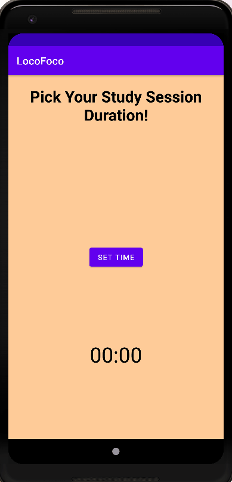
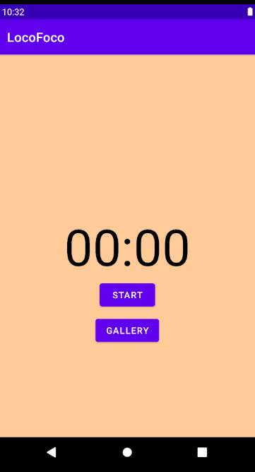
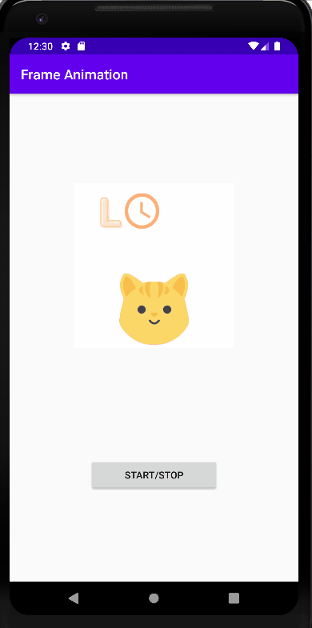
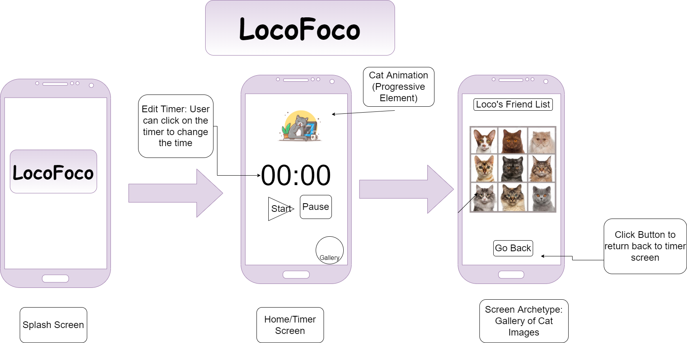
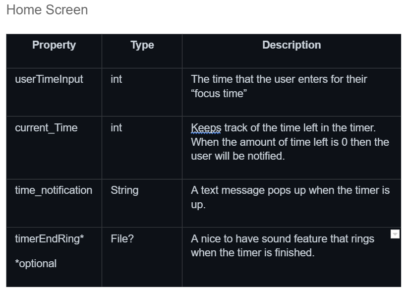
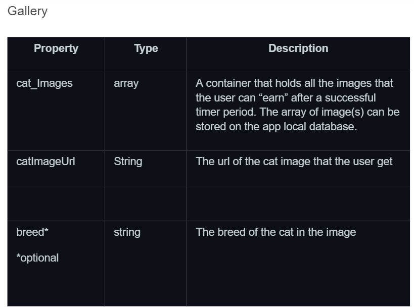
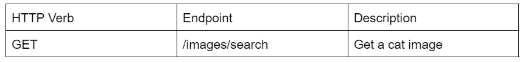

Original App Design Project 
===

# LocoFoco

## Table of Contents
1. [Overview](#Overview)
1. [Product Spec](#Product-Spec)
1. [Wireframes](#Wireframes)
2. [Schema](#Schema)

## Overview
### Description
LocoFoco is a productivity app that helps users maintain an efficient balance of studying and rest periods. Our app implements the pomodoro timing technique along with a friendly cat, Loco, who encourages users to keep their focus by rewarding them with a cute cat image at the end of their focus session! 

### Build Progress (Updated as of 02/27/22)

## Timer Main Screen: Start/Stop

## Upload Cat Image in Gallery

## Test Animation of Loco (Start and Stop)

## Main Acitivity -> Gallery

## Test Animation of Logo 

### App Evaluation
- **Category:** Productivity 
- **Mobile:** This is app can be used on Android mobile phones. 
- **Story:** Times the user study and break periods. Will also run a cat animation to motivate the user. 
- **Market:** Primarily, any individual who needs to accomplish a task within a period of time would be interested in using the timer app to help them pace their productivity. 
- **Habit:** As long as there's a task that needs to get done, this focus app can be used at any time of day the user feel is their productivity time. 
- **Scope:** At the start of this project, the present members, Xinyi and Stephany will complete the overview of the Focus App in the ReadMe File. From there, we will consult with the rest of team on further features and planning to integrate the groundworks of the app.

## Product Spec

### 1. User Stories (Required and Optional)

**Required Must-have Stories**
* [x] Users can start/reset/pause timer
* [ ] Set/edit timer
* [x] Have Cat Images Show Up In Gallery
* [x] Progressive element: pop up a cat image at the end of a focus session (using a cat pic API)

**Optional Nice-to-have Stories**

* Study Music Playing in the Background (user's choice from their Spotify Playlist)
* Google calendar integration
* Users can view/edit the list of tasks

### 2. Screen Archetypes

* Home Screen
   * Timer
   * Settings to change timer
   * Cat animation
* Gallery Page
   * Showcase all the cat images that user has acquired
   

### 3. Navigation

**Tab Navigation** (Tab to Screen)

* Home Screen Button
* Gallery Button

**Flow Navigation** (Screen to Screen)

* Open the app -> Home Screen
   * Click on Gallery Button to go to Gallery Page
* Gallery Page 
   * Click on Home Screen to go back to Home Screen
  

## Wireframes

### [BONUS] Digital Wireframes & Mockups

### [BONUS] Interactive Prototype

## Schema 
[This section will be completed in Unit 9]
### Models

### Networking
Home screen:
(Read/GET) Get a random cat image

# Existing API Endpoints
Base url: https://api.thecatapi.com/v1

- TheCatApi: https://docs.thecatapi.com/

